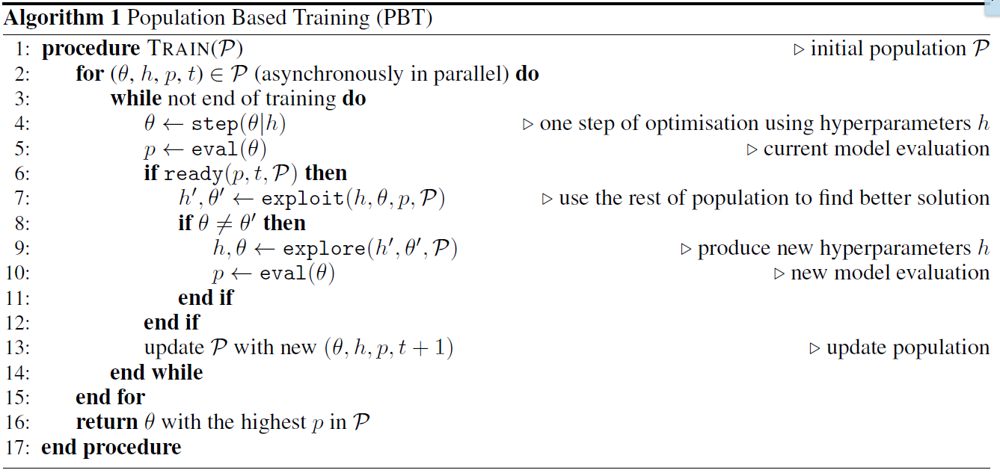

# Population-Based Training (PBT) for Neural machine translation (NMT)

## Introduction

Neural Networks showed great success in most of the domains they are used in starting from audio/images classification, playing video games, as well as, machine translation, and other tasks Natural Language Processing (NLP) related.
Building and training a neural network for a specified task is easy, however, optimization of networks is still a hard task to do, specially, when dealing with General Adversarial Networks (GANs) or Double SARSA/Actor Critic based Deep Reinforcement Learning techniques. As there are a lot of hyper parameters to tune, this tuning can be done using different optimization techniques.

Hyperparameters are the set of parameters that define how the model will be structured. It can be thought of it as searching a parameters space to find the best parameters. i.e. our aim is to find the optimal set of hyperparameters as per task. Generally, this process can be broken down into the following:

1. Defining and building the model
   - Task specific
2. Define a range of possible values
   - Recurrent Neural Network LSTM based
     - Dropout
     - Recurrent Dropout
     - Batch Size
     - Number of Epochs
   - Decision Trees classifier
     - Number of trees
     - Maximum depth
3. Define an evaluation criteria

---

## Optimization Techniques

Optimization techniques can be categorized into 2 classes:

1. Parallel Search: many parallel optimization processes, trains multiple networks with different set of hyperparameters, for example Grid Search & Random Search.
2. Sequential Optimization: it follows same paradigm as parallel search for few iterations of optimization and get the output of these iterations utilizing them to improve NNs performance gradually, for example Manual tuning & Bayesian Optimization.

- Sequential optimization will be better compared to parallel, however, it is not feasible for long optimization processes.

### Brief about different optimization approaches

1. Grid Search: Most basic tuning method, which is based on building and training models as per each set of hyper parameters, which is very time and resources consuming, e.g. if we have a model and 100 combinations of hyperparameters, this means we have to wait for training of 100 models and then pick the best. This illustrates the suffering of Grid Search if the number of parameters grow.
2. Random Search: several neural networks are built and trained asynchronously, and the best one in terms of performance is selected. But, all NNs are trained in the same time regardless of how promising the network will be at the end. It is easy to notice, that some NNs are not as good and will consume computational resources that can be saved.
3. Manual Tuning: Deep Learning practitioner has to guess a set of hyper parameters, and train the NN. This is a basic iterative optimization method which takes a lot of time, which can be invested in something else, which increase the chances of finding best fit params comparatively higher; as the random search ends up optimizing parameters without any aliasing.
4. Bayesian Optimization: Unlike what was mentioned earlier, it keeps track of past evaluation results, which are used to form a probabilistic model mapping hyperparameters to a probability of a score on the objective function

---

## Population Based Training of Neural Networks

It basically is an optimization technique that aims to get the best of both worlds parallel and sequential optimization. So, it trains multiple networks at the same time, and also able to use fewer computational resources in comparison with random/grid search. It leverages information sharing across a population of concurrently running optimization process and allows for online transfer of hyperparameters between members based on performance.

## Definition

It starts like parallel search by randomly sampling hyperparameters and weights initialization of the model. Nevertheless, each training runs asynchronously evaluate its performance periodically. If the model is under-performing, it will exploit the rest of the population by replacing itself with a better performing model, and it will explore new hyperparameters by modifying the better model's hyperparameters, before training is continued. The result is a hyperparameter tuning method that while very simple, results in faster learning, lower computational resources, and often better solutions.

So, Simply, it is an asynchronous optimization algorithm which effectively uses a fixed computational budget to jointly optimize a set of neural networks (will be referred to as "population" later) and their hyperparameters to maximize the performance.

PBT discovers a schedule of hyperparameters settings rather than following the generally sub-optimal strategy of trying to find a single fixed set to use through the whole course of training

## Problem Formulation

In Neural Networks our aim is to optimize the parameters of the network θ of a model f to maximize a given objective function Q. Updating the parameters is done iteratively using stochastic gradient descent (SGD), updates are done based on performance metric Q which is different from Q, which can be accuracy on validation set, inception score for measuring performance of GANs, or BLEU for neural machine translation. PBT aims to improve both weights θ and hyperparameters h jointly.
To find optimal model weights `θ * = argmax(eval(θ)); θ ∈ Θ`

This iterative approach of optimizing the weights is computationally expensive, due to the number of required, as well as, the computational cost of every step.This process might even take days to do. Not to mention that, the hyperparameters have a huge impact on how the model will perform, so if they were chosen haphazardly, the model might not converge.

## How it works

PBT can be broken down into 2 methods which can be invoked independently on each member of the population
Exploit: which selects to abandon the current member and focus on more promising members, given the performance of the whole population
Explore: which given the current solution and hyperparameters proposes new ones to better the solution space.
As mentioned earlier, each member is trained individually synchronously with other members, with iterative calls of “step” to update the member weights and evaluate its
current performance. But, if a member reaches the threshold of performance or is deemed ready, its weights and hyperparameters are updated using “exploit” and “explore
. Exploit to replace the current weights with the weights of the best model, and Explore to randomly perturb the hyperparameters with noise. And then it continues
training iteratively until convergence (repeating the previously mentioned approach). Eval was mentioned multiple times, with no clarification, so eval is the mean
episodic return or validation set performance of the metric used to optimize the networks. Exploit selects another member of the population to copy weights and
hyperparameters from. Explore, creates new hyperparameters for the next timesteps of gradient based learning either by perturbing the current parameters (by adding
noise to it) or resampling the hyperparameters from originally defined prior distribution.

Combining all of that, PBT benefits from local optimization by GD, and periodic model selection, as well as, hyperparameters refinement from process similar to genetic
algorithms.

---

## References

1. [Population Based Training of NN paper- arxiv](https://arxiv.org/abs/1711.09846)
2. [Deepmind Blog](https://deepmind.com/blog/population-based-training-neural-networks/)
3. [Optimization techniques Blog I](https://towardsdatascience.com/a-conceptual-explanation-of-bayesian-model-based-hyperparameter-optimization-for-machine-learning-b8172278050f)
4. [Optimization techniques Blog II](https://medium.com/@senapati.dipak97/grid-search-vs-random-search-d34c92946318)
